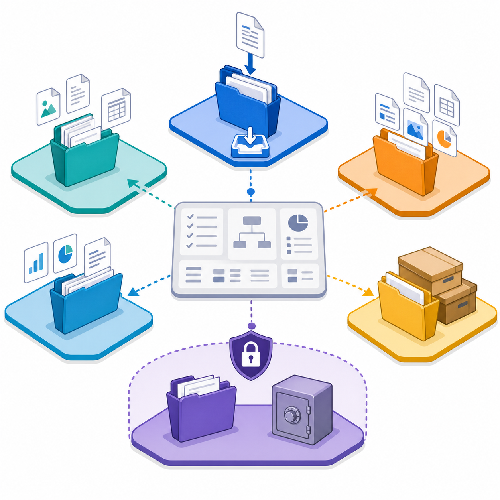

# Codex Operating Architecture — English

[中文说明 / Chinese README](README.md)

This repository is a verified, self-iterating operating architecture for local Codex work. A single controller routes tasks to focused skills for project lifecycle, requirements, execution, knowledge, learning, error feedback, runtime environments, Git, and release safety.

## Repository channels

- `origin`: private continuous-development repository.
- `public`: public releases only, after explicit user authorization.

## Core guarantees

- Project facts remain project-local; only verified cross-project rules are promoted.
- Experience, knowledge, and user study material are separated.
- Secrets, raw session history, browser state, and local machine paths do not enter Git.
- A verified iteration may use the private auto-Git gate only with scoped paths, private-origin confirmation, bilingual GitHub metadata, validation, and a semantic-version decision.
- Public pushes, tags, and GitHub Releases are never automatic.
- Public candidate snapshots are checked for private remote identities, private-state paths, local paths, and secret-shaped content before any public push.
- Complex knowledge, experience, and workflow relationships use a sanitized GPT-first visual decision, with deterministic SVG/Mermaid fallback and lifecycle-aware edit, regenerate, or delete handling.
- File organization uses a transactional isolate-copy, backup, full-scope organize, reference-repair, Git-layout restore, full-validation, and validated-replacement loop. The default scope is every non-backup, non-protected file under the project root, not only `00-inbox`; `.git`, `.codex`, credentials, and external backup roots always remain excluded. Organization occurs only in the isolated copy. Any failure is repaired and revalidated there, and the active system is never replaced until every check passes. The complete pre-Git iteration runs this workflow automatically, while the review gate accepts only a validated replacement proof. Like workflows, its taxonomy can be retained, refined, added, merged, split, deprecated, or removed from evidence. See [File Organization Architecture](docs/assets/file-organization-architecture.mmd) and [image provenance](docs/assets/file-organization-concept.provenance.md).



## Quick start

```powershell
git clone <repository-url> <architecture-root>
Set-Location <architecture-root>
.\scripts\install-global.ps1 -Mode Junction
.\skills\codex-skill-portability\scripts\Initialize-PortableSkillConfig.ps1
.\scripts\validate.ps1
```

## Daily validation and private Git

```powershell
.\scripts\validate.ps1
.\scripts\validate-global-install.ps1
.\skills\codex-git-operations\scripts\Invoke-VerifiedPrivateCommit.ps1 -Paths <iteration-paths>
```

Read [Verified Private Auto-Git](docs/AUTO-GIT-PRIVATE.md), [GitHub Publication Metadata](docs/GITHUB-PUBLISHING.md), and [Dual Repository Release Flow](docs/DUAL-REPOSITORY-RELEASE.md). These GitHub-facing guides contain Chinese counterparts in the same files.

## Iteration synchronization and public conversion

Every verified implementation iteration generates [Iteration Status](docs/ITERATION-STATUS.md), which records version, module count, and the required documentation gate. Private skills, knowledge, and experience can become public candidates only after two independent verified evidence sources, sanitization, validation, and a separate release decision. See [Private-to-Public Skill Conversion](docs/PRIVATE-TO-PUBLIC-CONVERSION.md).

Every iteration also reviews both README files, the [Changelog / 更新日志](CHANGELOG.md), and applicable guides for consistency with the implemented behavior. When a knowledge, experience, or workflow relationship has three or more non-linear connections, use a sanitized GPT-first explanatory image when it materially improves understanding; use SVG or Mermaid only when generation is unavailable or the structure is simple and deterministic.

## Release notes

Read the user-facing [Changelog / 更新日志](CHANGELOG.md) for every release and operational update.
