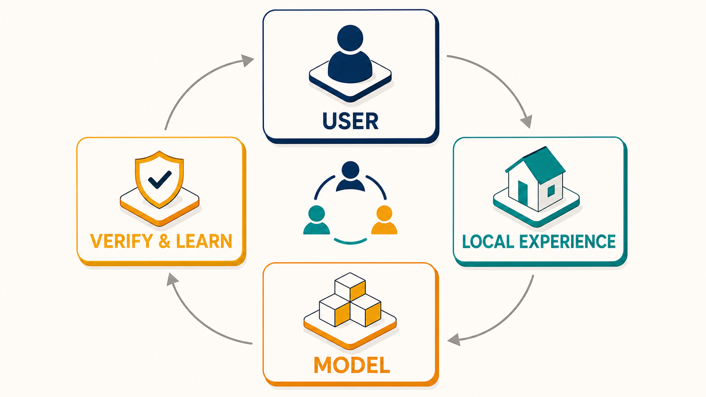
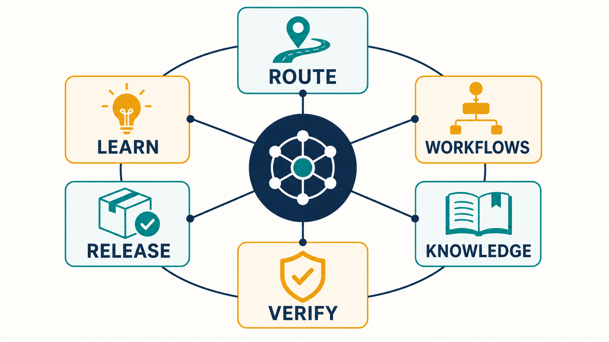
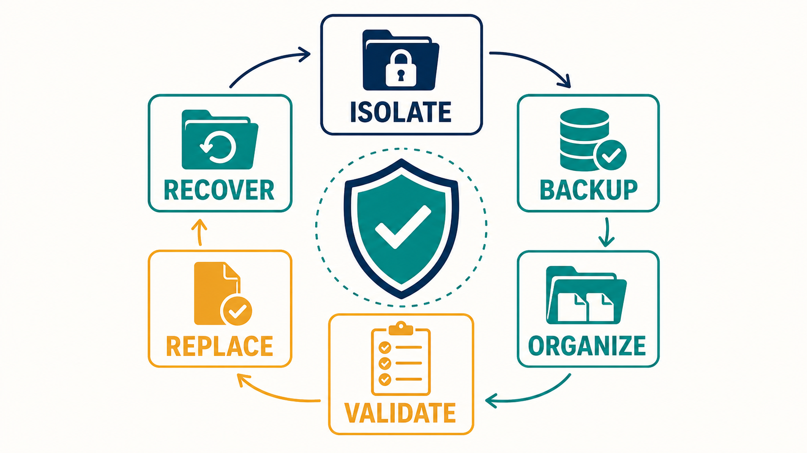
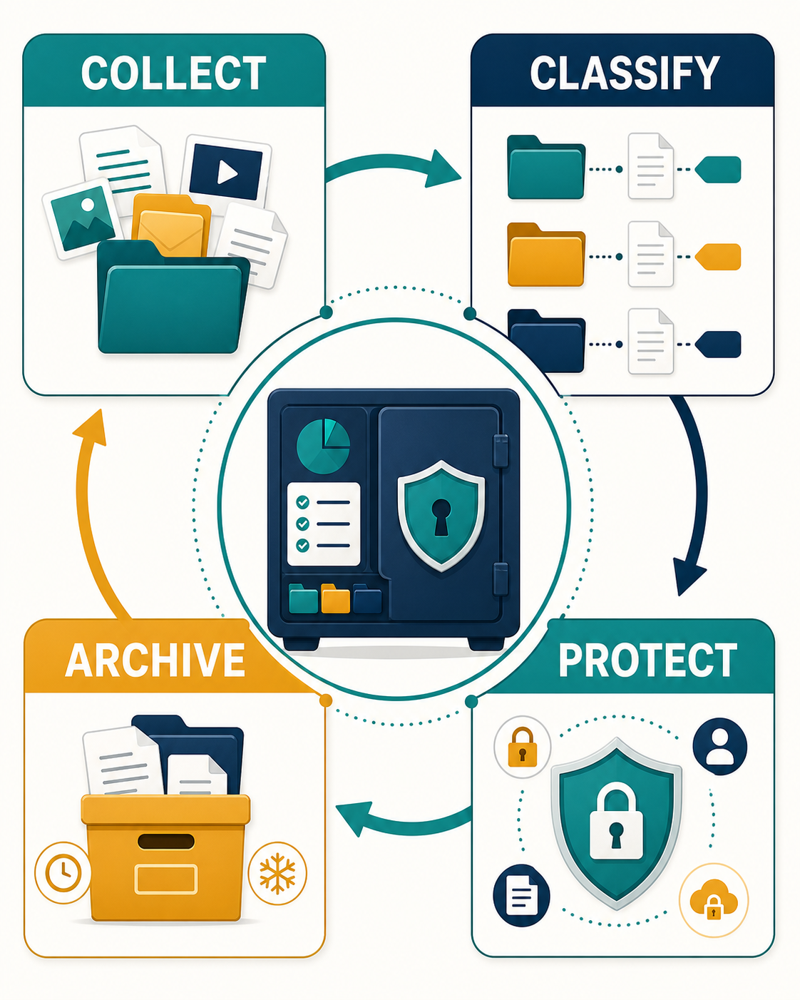

# Codex Global Experience System

[中文说明 / Chinese README](README.md)

> A collaboration-oriented local Codex system: user intent, verified local experience, and model capability work together under explicit authority and validation.

## Start here

| Goal | Start with |
|---|---|
| Enter a structured workflow for a new project | `$codex-self-evolution` |
| Diagnose an unexpected outcome | `$codex-error-feedback` |
| Learn from an external method or repository | `$codex-learning` |
| Improve user-facing documentation | `$github-readme-presentation` |

Reuse project facts, verified experience, and deterministic tools first. Use model work, web research, image generation, or external dependencies only when they materially improve the result.

## How it works

The user supplies the outcome and authority. The system chooses the smallest necessary owner set; experience, knowledge, and tools complete reusable work; the model contributes reasoning or creation; verification and error feedback decide what may be retained, committed, or released.



## The system



- **Route** work to an existing owner instead of duplicating capability.
- **Retain** project knowledge locally; promote only cross-project verified lessons.
- **Protect** credentials, raw sessions, and local private paths from Git.
- **Evolve** only when a change has observable contribution and no-regression evidence.

## Reliable delivery





Global iteration uses isolation, backup, validation, replacement, and recoverable rollback. Reader-facing images, explanations, and release material are checked for existence, legibility, and delivery format; PNG/JPG/WebP are used for ordinary reader delivery rather than Mermaid/SVG sources.

## Quick start

```powershell
git clone <repository-url> <architecture-root>
Set-Location <architecture-root>
.\scripts\install-global.ps1 -Mode Junction
.\scripts\validate.ps1
```

See [Iteration Status](docs/ITERATION-STATUS.md), [Changelog / 更新日志](CHANGELOG.md), [portable configuration](docs/PORTABLE-SKILL-DISTRIBUTION.md), and [publication rules](docs/GITHUB-PUBLISHING.md) for maintenance details.

<!-- BEGIN MANAGED BLOCK: latest-release -->
## Latest Release / 最新发布

- Version: `1.11.0.0`
- Channel: `Private` / 私有
- Release note: [docs/release-notes/v1.11.0.0.md](docs/release-notes/v1.11.0.0.md)
- Highlights: Release documentation, Lifecycle controller, Skill architecture, Automation gates
- Visual: [docs/assets/release-visual-highlights-labeled.png](docs/assets/release-visual-highlights-labeled.png)
- README optimization: audited with github-readme-presentation; provenance: [docs/release-readme-audits/v1.11.0.0.json](docs/release-readme-audits/v1.11.0.0.json)
- README 优化已通过已安装的 GitHub README 与 Profile 展示工作流复核；不引入无证据的指标或跟踪组件。
- 中文：本次发布会同步刷新 README、发布说明和必要的图示/排版材料。
<!-- END MANAGED BLOCK: latest-release -->
