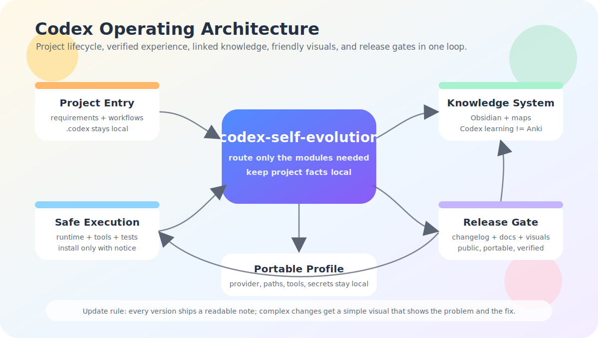

# Codex Operating Architecture

English counterpart: [README.en.md](README.en.md)

每次系统迭代都会同时检查两个 README、[更新日志 / Changelog](CHANGELOG.md) 和适用说明文件是否与实际实现一致。知识、经验或工作流存在三个及以上非线性关系且图片能明显提高理解时，优先使用经过脱敏的 GPT 生图；仅在生图不可用、结构简单或确定时使用 SVG/Mermaid 回退。

全局文件整理采用“隔离复制、备份与整理、验证沙箱、建立精确迭代前快照、替换、当前目录清理、双重全局复验、生命周期写回”的事务循环。迭代前快照保存所有可能被替换的本地文件和 SHA-256，包括未提交内容，但排除 `.git`、`.codex`、凭据和运行时。任何步骤在替换前失败时当前系统保持不变；替换后失败时自动恢复被修改或删除的文件、移除迭代新增文件、逐项复核哈希并刷新真实全局接口。回退成功后记录错误并要求修复根因、从头重新迭代；回退失败则保持未完成状态并报告严重错误。自动清理仍只处理当前未跟踪的白名单临时/缓存文件及空目录，并在删除前进入外部哈希隔离区。Git 门禁只接受同时具备回退就绪、替换、复验和写回证明的结果。详见 [文件整理架构图](docs/assets/file-organization-architecture.mmd) 与 [图片溯源](docs/assets/file-organization-concept.provenance.md)。

当错误本身用于测试和排查文件整理模块或全局迭代模块时，可进入“持续诊断模式”：每次失败都记录归属与证据，执行显式的安全修复，再从头复测，直至成功。该模式默认没有人为次数上限，但不会绕过回退校验、凭据、安装、破坏性操作或外部发布边界；回退失败或修复动作失败会立即转为阻断错误。


## 迭代说明同步与公开转化

每次已验证的实现迭代都会生成 [Iteration Status](docs/ITERATION-STATUS.md)，记录版本、模块数量和说明门禁。私有 skill、知识与经验只有在具备两个独立已验证证据、完成脱敏和验证后，才能成为公开候选；公开发布仍须单独决策。详见 [Private-to-Public Skill Conversion](docs/PRIVATE-TO-PUBLIC-CONVERSION.md)。

明确的“同步经验系统”请求走私有发布门禁，不只是提交和推送：`Invoke-ExperienceRelease.ps1 -Mode Private` 会在私有 `origin` 仓库发布 GitHub Release，Git 标签为 `private-vP.R`，Release 标题为 `vP.R`。

面向本地 Codex 的可迭代经验与知识架构：用 1 个总控 skill 调度 22 个功能模块 skill，让项目启动、需求整理、执行验证、经验沉淀、知识图谱、图片工作流和 Git 发布形成闭环。



## Repository channels

- `origin` is a local-only private working remote for normal updates.
- `public` is the reviewed public-release remote and is used only after explicit release authorization.
- Public release checks reject private remote identities, local paths, credentials, tokens, and private-state paths before any public push.

## 为什么使用

- 自动进入项目生命周期：首次使用项目时建立需求、工作流、经验、复盘和状态文件。
- 经验不再只留在聊天里：验证后的规则进入 skill、经验账本或 Obsidian 知识库。
- 代码库学习优先使用结构化证据：安装并配置 `codebase-memory-mcp` 后，Codex 可先索引项目图谱，再按图谱结果读取必要源文件；图谱搜索用于路由取证，最终结论仍需源文件核验。全局生命周期入口会在 MCP 工具可用且项目是源码仓库时主动运行 fast `index_repository` 预热；若当前任务未暴露 MCP，则记录不可用并回退到本地文件取证。
- Codex 学习和用户 Anki 分开：Codex 自己要记的规则不强迫用户背。
- 可移植发行：Git 中只保留通用流程，provider、路径、账号、软件选择和凭据留在本地 profile。
- 图片和导图可追溯：Mermaid/MindMaster/SVG/图床图片都是派生视图，Markdown 和 manifest 保持权威。
- GitHub 发布有门禁：每次非合并提交都要更新 changelog，涉及公开使用方式时同步 README 或 docs。
- 知识、经验和工作流出现多个交互关系时，优先基于脱敏摘要使用 GPT 生图；不可用或结构简单时使用 SVG/Mermaid，变更后按结构决定修图、重生或删除。

## 快速开始

```powershell
git clone <repository-url> <architecture-root>
Set-Location <architecture-root>
.\scripts\install-global.ps1 -Mode Junction
.\skills\codex-skill-portability\scripts\Initialize-PortableSkillConfig.ps1
.\scripts\validate.ps1
```

打开新的 Codex 任务后，全局 `AGENTS.md` 会先路由 `$codex-self-evolution`。如果当前项目缺少 `.codex/project/state.json`，再由项目初始化流程创建本项目自己的需求、工作流、经验和复盘。

## 日常命令

```powershell
# 发行安全的空历史目录
python .\scripts\index_history.py

# 仅本机需要历史检索时使用
python .\scripts\index_history.py --include-local-history

# 全量验证
.\scripts\validate.ps1

# 全局 skill 接口验证
.\scripts\validate-global-install.ps1

# 新项目初始化
.\scripts\init-project.ps1 -ProjectRoot <project-root>
```

## 目录结构

| 路径 | 作用 |
|---|---|
| `skills/` | 23 个可安装到全局的 Codex skill 目录 |
| `module-registry.json` | 模块增减、合并、停用的证据注册表 |
| `knowledge/experience-ledger.md` | 已验证、跨项目、非重复的经验账本 |
| `knowledge-vault/` | Obsidian 知识库、工作流、导图和 Anki 卡片源 |
| `knowledge/history-catalog.json` | 发行安全空目录；本机历史需显式生成 |
| `config/` | 全局 AGENTS、软件安装和图床策略 |
| `docs/` | 需求手册、发布规则、可移植配置和版本说明 |
| `scripts/` | 安装、验证、历史索引、项目初始化和发布门禁 |

`.codex/` 是本机或具体项目的运行状态目录，默认由 `.gitignore` 排除，不进入发行包。

## 架构闭环

1. `codex-self-evolution` 读取项目状态，选择最小必要模块。
2. 需求、执行、工作流、运行环境、安装、凭据、图片、Git 等模块各自负责清晰边界。
3. 完成验证后，项目经验先进入项目 `.codex/project`；只有跨项目有效的结论才晋升到全局经验或 skill。
4. 知识系统把已验证经验组织成 Obsidian note、MindMaster 大纲、Mermaid 导图和 Codex 本地学习索引。
5. Git 发布前运行验证和元数据门禁，确保说明、版本、变更和隐私边界同步。

## 可移植配置

仓库中的文档和脚本使用逻辑根，不写个人盘符：

- `$ARCHITECTURE_ROOT`
- `$CODEX_HOME`
- `$SOFTWARE_ARCHIVE_ROOT`
- `$SOFTWARE_INSTALL_ROOT`
- `$IMAGE_QUARANTINE_ROOT`

克隆者的私有选择写入 `~/.codex/private-skill-config/portable-skill.json`。模板使用 `test-provider`、`TEST_API_KEY`、`test-model`、`test-tool` 这类占位名；不要把真实密钥、Cookie、账号、浏览器状态或 `auth.json` 放进 Git。

更多说明见 [Portable Skill Distribution](docs/PORTABLE-SKILL-DISTRIBUTION.md) 和 [Portable Path Configuration](docs/PATH-CONFIGURATION.md)。

## 知识、学习与图片

用 Obsidian 打开 `$ARCHITECTURE_ROOT\knowledge-vault`。Markdown 是权威源，MindMaster、Mermaid、SVG 和图床图片是派生视图。

```powershell
python .\skills\codex-knowledge-system\scripts\build_knowledge.py
python .\skills\codex-knowledge-system\scripts\build_mindmaps.py
```

学习受众必须显式区分：

- `learning_audience: codex` 进入 `50-Learning/codex-learning.json`，供 Codex 后续任务迭代经验。
- `learning_audience: user` 进入 `50-Learning/user-anki-import.tsv`，供用户导入 Anki。
- `both` 需要分别写 Codex 规则和用户回忆卡片。

图片只在能明显降低理解成本时加入。结构图优先使用 Mermaid 或仓库内 SVG；需要图床迁移时，必须按需触发、先预览、远程验证成功后再替换和清理本地图片。禁止定期扫描。

## 版本更新说明

每次版本更新至少包含：

- [更新日志 / Changelog](CHANGELOG.md) 中的用户可读变更说明。
- 如改变安装、配置、工作流、安全边界或发行体验，同步 README 或对应 docs。
- 如改变版本号，同步 `VERSION`、`docs/release-notes/v<version>.md`，并确保 `CHANGELOG.md` 存在该精确版本的条目。
- 如变更复杂或影响多个模块，增加或更新一张图来解释问题、解决路径和新架构位置；先使用脱敏 GPT 生图，生图不可用时才使用 `docs/assets/` 中可版本化的 SVG/Mermaid 派生图，并同步图片溯源与 README。

发布规则见 [GitHub Publication Metadata](docs/GITHUB-PUBLISHING.md)。

## 软件安装边界

普通 skill、模板、脚本和配置处理不需要逐项提示。外部软件、系统组件、运行时或会改变系统环境的依赖安装前，必须先说明对象、来源、范围、目标路径和影响。

软件包默认进入 `$SOFTWARE_ARCHIVE_ROOT`，支持自定义路径的软件进入 `$SOFTWARE_INSTALL_ROOT`。现有软件满足需求时不因版本较旧自动升级。
