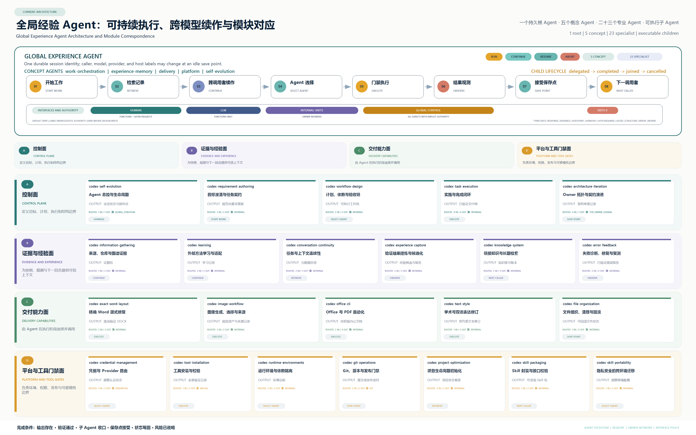
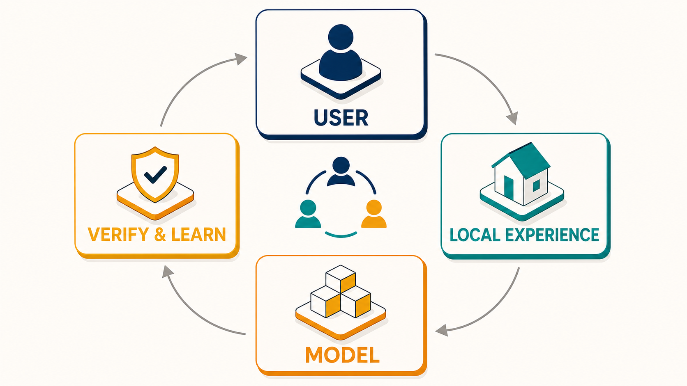
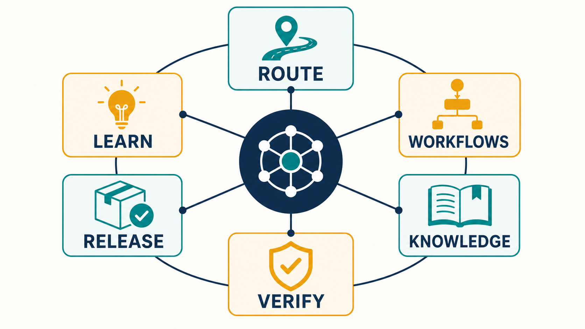
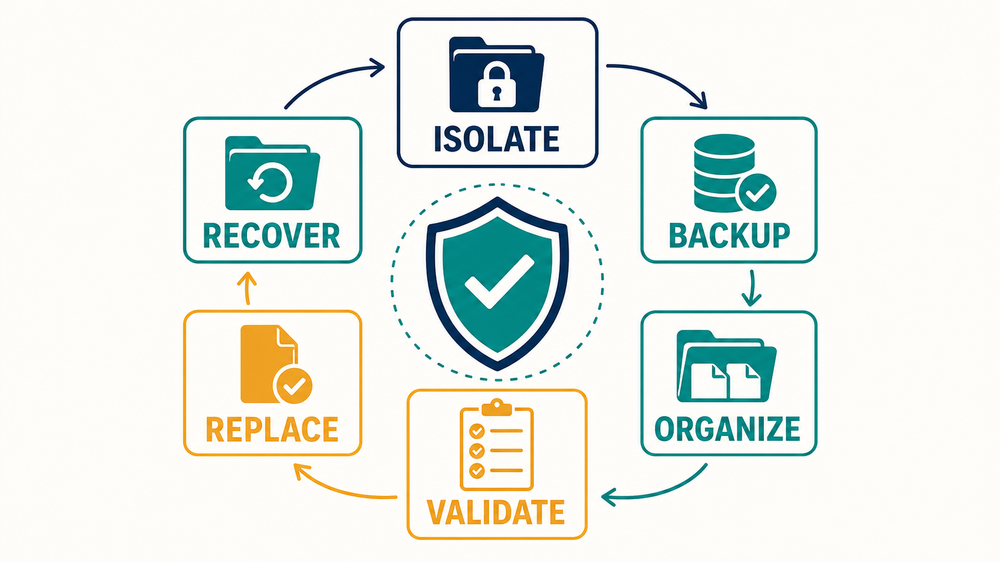
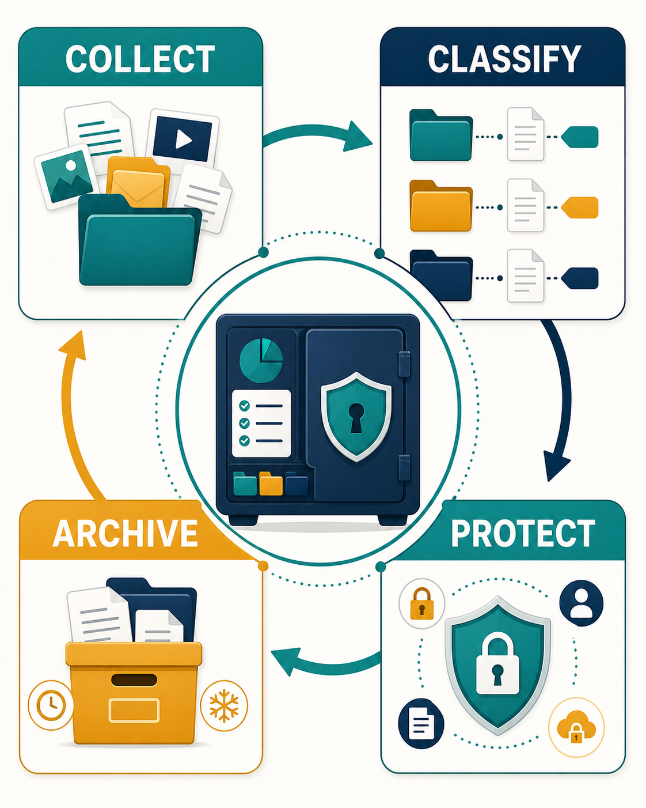

# Codex 全局经验 Agent

English: [README.en.md](README.en.md)

> 面向本地 Codex 的协作型根 Agent：让用户目标、Agent 记忆、已验证的本地经验与模型能力在清晰授权和验证下共同完成工作。

## 从这里开始

| 目标 | 入口 |
|---|---|
| 新项目进入规范工作流 | `$codex-self-evolution` |
| 处理异常或错误 | `$codex-error-feedback` |
| 学习并吸收外部方法 | `$codex-learning` |
| 优化用户说明 | `$github-readme-presentation` |

先复用项目事实、已验证经验和确定性工具；只有能提升结果时，才使用模型、联网检索、图片生成或外部依赖。

## 全局经验 Agent

全局经验系统现在以一个可持续执行的 **Global Experience Agent** 工作。其物理文件架构统一位于 [`agent/`](agent/README.md)：10 个编号分区对应根入口、权限接口、概念/专业/子 Agent、资源、运行时、证据、出口、呈现、维护和本地状态边界。23 个 Owner Skill 仍保留唯一实现，Agent 清单只建立对应关系，不复制能力。

规范入口是 `agent/40-runtime/Invoke-GlobalExperienceAgent.ps1`；`agent/80-maintenance/Sync-AgentFilesystem.ps1` 生成确定性目录投影，`Resolve-AgentFilesystemPath.ps1` 按类型化 ID 找到模块，`Test-AgentFilesystem.ps1` 拒绝配置与文件结构漂移。旧 `scripts/` 入口仅在下一个大版本前兼容转发。



## 协作闭环

用户定义目标与授权；系统选择最小必要 owner；经验、知识和工具先执行可复用工作；模型补足推理与创作；验证和错误反馈决定哪些结果可以保留、提交或发布。



## 系统如何工作




图谱在项目进入时由 Codebase Memory MCP 快速刷新；README 使用其上游 Three.js 图谱控制台渲染的无标签 PNG，展示架构结构密度而不公开路径、会话或源码文本。

- **路由**：按任务选择现有 owner，而不是重复创建能力。
- **解析**：`codex-office-cli` 负责 Agent 文档解析管线，把文本、CSV、基础 Office 与 PDF 预检统一为 `Document`/`Chunk`，进入 Agent 记忆或知识前先完成内容、结构、性能、健壮性验证。
- **沉淀**：项目经验先留在项目；只有跨项目验证的结论才进入全局系统。
- **安全**：凭据、原始会话和本机私有路径不进入 Git；外部变更仍须用户授权。
- **演进**：每次改进都需要可观察贡献与无回归验证；不能证明净收益就保留现状。

## 可靠交付





全局迭代通过隔离副本、备份、验证、替换和可恢复回滚来保护现有工作。图片、说明和发布材料也需经过存在性、可读性和格式验证；普通读者交付使用 PNG/JPG/WebP，不以 Mermaid/SVG 源文件作为展示目标。

## 快速开始

```powershell
git clone <repository-url> <architecture-root>
Set-Location <architecture-root>
.\scripts\install-global.ps1 -Mode Junction
.\scripts\validate.ps1
```

更多操作见 [Iteration Status](docs/ITERATION-STATUS.md)、[更新日志 / Changelog](CHANGELOG.md)、[可移植配置](docs/PORTABLE-SKILL-DISTRIBUTION.md) 和 [发布规则](docs/GITHUB-PUBLISHING.md)。

<!-- BEGIN MANAGED BLOCK: latest-release -->
## Latest Release / 最新发布

- Version: `1.0.0.0`
- Channel: `Private` / 私有
- Release note: [docs/release-notes/v1.0.0.0.md](docs/release-notes/v1.0.0.0.md)
- Highlights: Lifecycle controller, Release documentation, Knowledge and experience, Skill architecture, Automation gates
- Visual: [docs/assets/release-visual-highlights-labeled.png](docs/assets/release-visual-highlights-labeled.png)
- README optimization: audited with github-readme-presentation; provenance: [docs/release-readme-audits/v1.0.0.0.json](docs/release-readme-audits/v1.0.0.0.json)
- README 优化已通过已安装的 GitHub README 与 Profile 展示工作流复核；不引入无证据的指标或跟踪组件。
- 中文：本次发布会同步刷新 README、发布说明和必要的图示/排版材料。
<!-- END MANAGED BLOCK: latest-release -->
