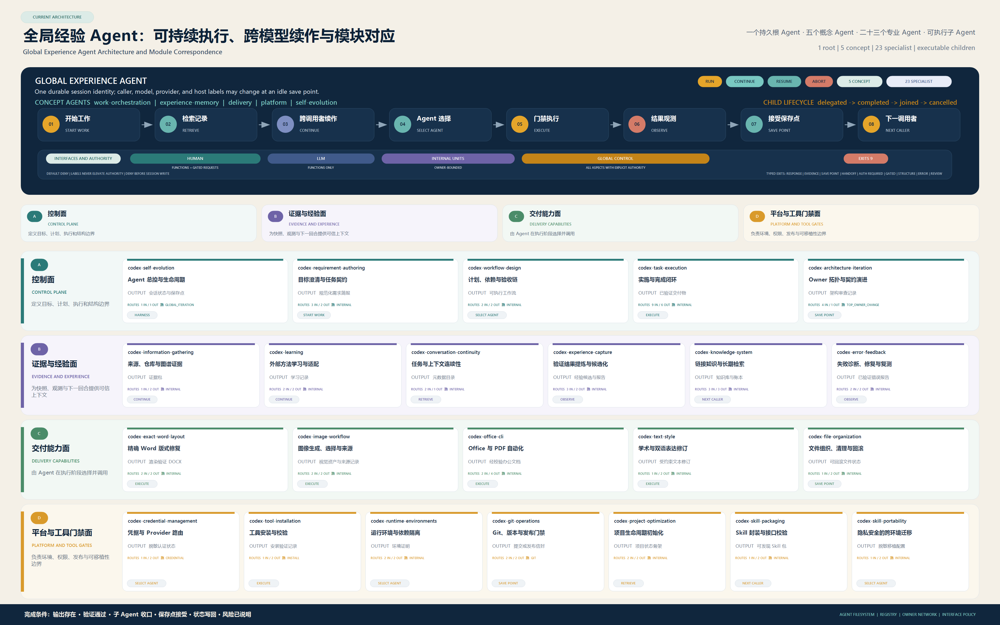

# Global Experience Agent Architecture / 全局经验 Agent 架构

## English

The global experience system is one executable durable Agent. It is not a renamed skill catalog, a parallel memory service, or an external runtime. `codex-self-evolution` owns the root harness, and `agent/40-runtime/Invoke-GlobalExperienceAgent.ps1` is the single canonical entrypoint for `Inspect`, `Verify`, `Run`, `Continue`, `Resume`, and `Abort`.

`Run StartWork` creates durable work and retrieves relevant records. `Continue` allows another authorized caller or compatible model host to act from an idle save point. `Resume` reconstructs work, records, next actions, caller/model history, and child state. `RouteOwner` resolves one of the 23 specialist Agents without executing gated side effects. Child-Agent delegate, complete, join, and cancel operations own bounded subagent lifecycles under isolated write surfaces and explicit acceptance criteria.

`Auto` requests first pass through `ClassifyIntent`, a local four-layer intent funnel adapted from `LesterYu0/feynman-build-workshop/episodes/02-intent-recognition`. L0 handles explicit operations and fixed commands, L1 handles deterministic utterance/keyword routes, L2 is reserved for a future strict enum host classifier and is disabled by default, and L3 falls back to bounded `StartWork`. The resolved operation still passes through interface policy and owner gates before any side effect.

## Source of truth

| Surface | Owner role | What it defines |
| --- | --- | --- |
| `config/agent-system.json` | Behavioral contract | Runtime modes, operations, resources, gates, exit alignment, memory contract |
| `config/global-experience-agent-registry.json` | Agent identity | Root Agent, concept Agents, specialist Agent composition, continuation rules |
| `config/agent-interface-policy.json` | Permission policy | Human, LLM, internal functional-unit, and global-control capabilities |
| `config/agent-intent-policy.json` | Intent policy | L0/L1/L2/L3 routing rules for `Auto` and evidence-only `ClassifyIntent` |
| `config/agent-owner-connections.json` | Specialist handoff network | 23 owner-backed specialist Agents and their incoming/outgoing handoffs |
| `agent/agent-filesystem.json` | Physical topology | Numbered Agent filesystem zones, canonical surfaces, local ignored state |

## Physical filesystem

The repository-visible Agent lifecycle is stored under numbered zones:

- `agent/00-root`: root Global Experience Agent projection.
- `agent/10-interfaces`: human, LLM, internal functional-unit, and global-control interfaces.
- `agent/20-agents`: specialist, concept, and child-Agent templates.
- `agent/30-resources`: information and functional resource catalogs.
- `agent/40-runtime`: executable controller, runtime, state reader, and memory backend.
- `agent/50-evidence`: graph, lifecycle, and verification evidence projections.
- `agent/60-exits`: typed exit contracts.
- `agent/70-presentation`: diagram and documentation mapping.
- `agent/80-maintenance`: sync, resolve, and test tools for the filesystem projection.
- `agent/90-local`: local-only boundary; runtime state is not tracked.

Owner implementations remain under `skills/`. Runtime sessions, memory databases, snapshots, and temporary evidence remain under ignored `.codex/project` or `.runtime` paths. The deterministic projection is generated by `agent/80-maintenance/Sync-AgentFilesystem.ps1` and verified by `agent/80-maintenance/Test-AgentFilesystem.ps1`.

## Agent Memory System

The Agent memory system is a registered functional capability inside the Global Experience Agent, not a second root Agent. It adopts the useful patterns from `LesterYu0/feynman-build-workshop`: typed memory, exact retrieval, temporal validity, supersession, consolidation, and stable frozen snapshots. The local implementation is dependency-free SQLite + FTS5 in `agent/40-runtime/Invoke-AgentMemoryStore.py`.

Tracked files contain only backend code, contracts, tests, and knowledge summaries. Runtime data is local ignored state:

- database: `.codex/project/agent-memory/memory.db`
- frozen snapshot: `.codex/project/agent-memory/frozen-snapshot.md`
- knowledge note: `knowledge-vault/30-Knowledge/Agent Memory System.md`
- regression test: `scripts/Test-AgentMemorySystem.ps1`

Registered operations:

- `StoreMemory`: persist a typed memory record with layer, priority, TTL, evidence, and optional supersession.
- `SearchMemory`: retrieve active non-expired records through FTS5 search with safe fallback.
- `ConsolidateMemory`: archive stale records and freeze high-priority semantic/procedural records.
- `RenderMemorySnapshot`: render stable memory into a prompt-prefix style frozen snapshot.

Human, LLM, and internal-functional-unit callers may use these memory operations under current task authority. They cannot directly change Agent memory structure. Structural mutation of the memory system requires `global-control`, `global-structure` authority, declared target surfaces, and the `agent_structure` gate, then routes through `codex-architecture-iteration`.

## Interfaces, permissions, and exits

| Interface | Intended caller | Default capability | Direct Agent-structure mutation |
| --- | --- | --- | --- |
| `human` | People and interactive hosts | Observe, retrieve/continue work, use registered functional units, request gated work, and run review checkpoints | Denied |
| `llm` | Compatible model hosts | Observe, retrieve/continue work, use registered functional units including memory and review checkpoints | Denied |
| `internal-functional-unit` | Root, concept, specialist, and child Agents | Owner-bounded functions and review checkpoints under the parent task contract | Denied |
| `global-control` | Explicitly authorized human or supervised host | All registered permissions, including Agent review and structure routing | Allowed only through `global-structure` scope and `agent_structure` gate |

Every runtime response exposes `exit.type`, `exit.status`, `exit.audience`, `exit.authority_decision`, and `exit.next_authority_boundary`. Denied structure requests return `authorization-required` before durable session mutation. `RequestStructureChange` never edits structure directly; it returns an evidence route to `codex-architecture-iteration`. `ReviewAgent` returns `agent-reviewed` with book-derived review lenses and no structural side effect.

## Required protocols

- Project entry loads authority files, starts the `F-codex` graph UI, and refreshes graph evidence when the MCP tool is callable.
- Agent loop follows intake, orient, select, act, observe, and settle.
- Applied `Run` persists the local session, immutable turn snapshot, selected resources, gate decision, operation lifecycle, tool result, pending-write settlement, and save point.
- Runtime-like changes update future snapshots only; they do not rewrite in-flight proof evidence.
- Tool calls move through requested, preflighted, authorized, executed, observed, verified, and captured-or-reported states.
- Hooks and observability are redacted by default; prompts, completions, tool payloads, shell output, headers, and secrets are unsafe by default.
- Complete iteration proof binds rollback readiness, replacement, double validation, global-interface refresh, and lifecycle writeback.
- Publication and auto-Git bind exact `HEAD`, staged path hash, publication envelope, metadata, and private-origin evidence.

## Constraints

- No raw private sessions, credentials, browser state, prompts, completions, shell output, or local secrets enter Git.
- No arbitrary user/model public access is created. Continuation is caller/model neutral only for compatible authorized hosts with repository access.
- No ungated side effects: Git, release, install, credential, external, destructive, publication, and top-owner actions retain their owning gates.
- No proof reuse without exact `HEAD` and path-hash match.
- No automatic retry of unfinished provider streams or unsafe tool calls without owner-proven idempotency.
- No child-Agent delegation without registered profiles, bounded authority, isolated write surfaces, shared acceptance criteria, evidence-bearing completion, and merge verification.

## 中文

全局经验系统现在被定义为一个可执行、可恢复、可继续的本地 Agent。它不是把 Skill 目录换个名字，也不是新增一个并行的记忆服务或外部运行时。`codex-self-evolution` 是根 harness；`agent/40-runtime/Invoke-GlobalExperienceAgent.ps1` 是唯一规范入口，支持 `Inspect`、`Verify`、`Run`、`Continue`、`Resume` 和 `Abort`。

`Run StartWork` 用来创建持久工作并检索相关记录；`Continue` 允许另一个已授权调用者或兼容模型宿主从空闲保存点继续；`Resume` 重建工作、记录、下一步、调用者/模型历史和子 Agent 状态；`RouteOwner` 只解析 23 个 specialist Agent 的归属与交接，不执行带门禁的副作用；子 Agent 的委托、完成、汇合和取消都必须有边界、隔离写入面、验收标准和合并验证。

行为权威来自 `config/agent-system.json`、`config/global-experience-agent-registry.json`、`config/agent-interface-policy.json` 和 `config/agent-owner-connections.json`。文件系统权威来自 `agent/agent-filesystem.json`。这些文件共同定义根 Agent、概念 Agent、23 个 owner-backed specialist Agents、动态子 Agent、四类接口、工具门禁、保存点、恢复、退出协议和 Agent Memory。

Agent Memory 是 Global Experience Agent 内部注册的功能能力，不是第二个根 Agent。它参考 `LesterYu0/feynman-build-workshop` 中有价值的设计：记忆类型分类、精确检索、有效期、被替代关系、整理归档和 Frozen Snapshot。当前实现使用 SQLite + FTS5，不引入额外依赖，后端为 `agent/40-runtime/Invoke-AgentMemoryStore.py`。

运行态记忆数据不进入 Git：

- 数据库：`.codex/project/agent-memory/memory.db`
- 冻结快照：`.codex/project/agent-memory/frozen-snapshot.md`
- 知识说明：`knowledge-vault/30-Knowledge/Agent Memory System.md`
- 回归测试：`scripts/Test-AgentMemorySystem.ps1`

记忆操作包括 `StoreMemory`、`SearchMemory`、`ConsolidateMemory` 和 `RenderMemorySnapshot`。人类、LLM、内部功能单元都可以在当前任务权限内调用这些注册功能；未授权时不能直接改 Agent 结构。若要调整记忆系统结构，必须走 `global-control` 接口、`global-structure` 权限、明确目标文件面，并通过 `agent_structure` 门禁交给 `codex-architecture-iteration`。

四类接口的边界是：`human` 和 `llm` 可观察、检索、继续工作并使用注册功能；`internal-functional-unit` 只能在父任务授权边界内执行 owner 有界功能；`global-control` 在具备当前非秘密授权证据时，可以把结构调整请求路由到架构 owner。接口标签本身不提升权限，权限拒绝发生在持久会话写入之前。

所有运行时响应都必须暴露类型化退出：`exit.type`、`exit.status`、`exit.audience`、`exit.authority_decision` 和 `exit.next_authority_boundary`。完成任务前必须记录工具结果或错误反馈，运行最窄证明检查，接受或拒绝保存点，更新生命周期/候选状态，并报告剩余风险和下一权限边界。
