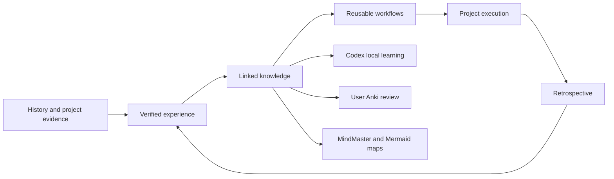

# Codex Knowledge Home

## Modules

- [[Knowledge System Module]]
- [[Research Knowledge Module]]
- [[Image Workflow Module]]

## Research workflows

- [[Literature Discovery Workflow]]
- [[Paper Reading and Evidence Workflow]]
- [[Academic Writing and Citation Workflow]]
- [[Scientific Figure Workflow]]
- [[Zotero Reference Workflow]]
- [[Image Hosting and Cleanup Workflow]]
- [[Mind Map Knowledge Workflow]]

## Core concepts

- [[Experience and Knowledge Architecture]]
- [[Learning Audience Boundary]]
- [[Verified Experience Promotion]]
- [[Provider Capability Boundary]]
- [[Project Knowledge Boundary]]
- [[Portable Path Configuration]]

See [[Knowledge Index]] for the generated inventory.

## Architecture Flow

