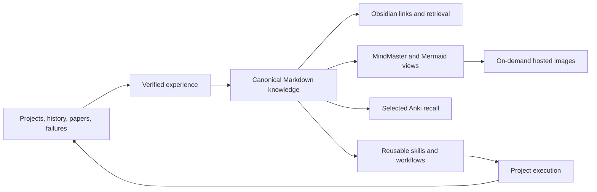

# Experience and Knowledge Architecture

This overview connects [[Global Experience System]], [[Verified Experience Promotion]], [[Knowledge System Module]], [[Learning Audience Boundary]], [[Mind Map Knowledge Workflow]], and [[Image Hosting and Cleanup Workflow]].

## Canonical flow

## Responsibility boundary

- Evidence supplies provenance; it is not copied wholesale into the vault.
- Verified experience records reusable actions, scope, validation, and invalidation conditions.
- Obsidian-compatible Markdown and typed links are the durable source of truth.
- MindMaster, Mermaid, and hosted PNG files are derived views for navigation and explanation.
- Anki contains only concepts whose active recall improves later decisions.
- Project execution produces new evidence and closes the iteration loop.

The PNG is generated by `build_architecture_overview.py`. It is user-owned, reproducible, and hosted only through the on-demand image workflow.
