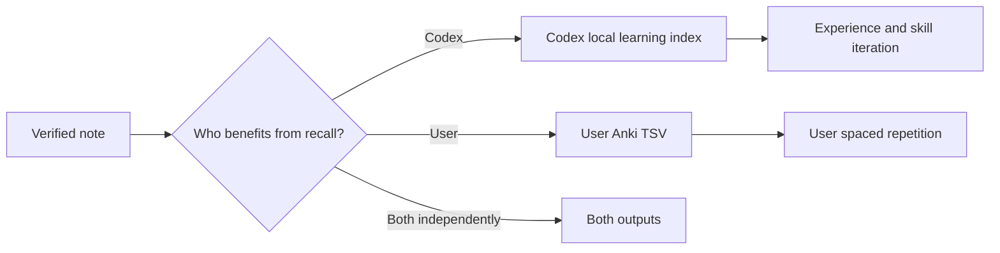

# Learning Audience Boundary

Codex and the user are different learners. A useful rule for future task execution is not automatically something the user should memorize.

## Codex-local learning

Use `learning_audience: codex` and `codex_learning`. The generated JSON is a local retrieval index for future Codex tasks. Promotion into a skill still requires [[Verified Experience Promotion]].

## User learning

Use `learning_audience: user` with `anki_question` and `anki_answer`. The prompt must test knowledge the user personally needs for research, technical judgment, or repeated decisions.

## Both

Use `both` only when the Codex operating rule and the user's recall goal each have independent value. Write separate wording for each audience rather than reusing one field mechanically.

This boundary is owned by [[Knowledge System Module]] and summarized in [[Experience and Knowledge Architecture]].
