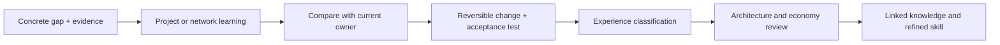

# Learning Governance

This learning owner connects [[Verified Experience Promotion]] and [[Knowledge System Module]] through two subworkflows: project learning and network learning. They share the same promotion boundary and therefore remain one owner rather than separate top-level skills.

## Trigger and evidence

Open a learning pass only for a concrete capability gap plus a qualifying project, network-currency, or user-recognized-capability signal. A user acceptance signal needs independent corroboration from a verified result, repeated use, project artifact, or source; praise and one turn are insufficient. No qualifying evidence means no learning action.

## Critical inheritance

For project learning, compare the candidate workflow’s trigger, inputs, outputs, owner, safety boundary, and validation against the global module registry. For network learning, prefer maintained primary sources and record the date, source, adopted/rejected/deferred decision, and local evaluation. A source is a candidate rather than a lesson until it survives a reversible test.

## Promotion loop

The external design input is that reliable agents need explicit guardrails, evaluation baselines, and human escalation for higher-risk actions; this architecture applies those ideas without granting a learning pass authority to make irreversible changes. Sources: [OpenAI practical guide to building agents](https://openai.com/business/guides-and-resources/a-practical-guide-to-building-ai-agents/), [OpenAI Evals API reference](https://platform.openai.com/docs/api-reference/evals/deleteRun?lang=python).
