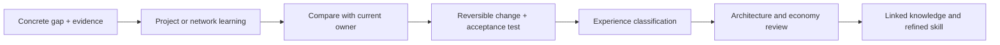

# Learning Governance

This learning owner connects [[Verified Experience Promotion]] and [[Knowledge System Module]] through two subworkflows: project learning and network learning. They share the same promotion boundary and therefore remain one owner rather than separate top-level skills.

## Trigger and evidence

Open a learning pass only for a concrete capability gap plus a qualifying project, network-currency, or user-recognized-capability signal. A user acceptance signal needs independent corroboration from a verified result, repeated use, project artifact, or source; praise and one turn are insufficient. No qualifying evidence means no learning action.

## Critical inheritance

For project learning, compare the candidate workflow’s trigger, inputs, outputs, owner, safety boundary, and validation against the global module registry. For network learning, prefer maintained primary sources and record the date, source, adopted/rejected/deferred decision, and local evaluation. A source is a candidate rather than a lesson until it survives a reversible test.

External learning is not limited to `SKILL.md` files. A repository, package, or method can be learned as a whole system: skills, workflows, knowledge records, experience patterns, scripts, manifests, release rules, setup docs, tests, terminology, and philosophy are all valid learning objects when they can improve the Global Experience Agent. Do not evaluate a source in isolation when related local knowledge, prior learning records, or adjacent external methods can sharpen the interpretation. Cross-source synthesis is allowed as a guarded experiment, provided the owner boundary, validation path, and invalidation condition remain explicit.

Every learning record should extract the source's core philosophy before
adopting tactics. Direct upstream principles should be distinguished from local
synthesis. When the source does not state its philosophy directly, infer it
from the repository shape, workflow order, scripts, manifests, tests, failure
modes, and safety boundaries, then mark the result as an inference with its
evidence basis. A philosophy can be useful even when it is wrong or only partly
compatible: keep it as a guarded analogy or experiment unless local validation
proves it should become a rule.

Learning records should classify adopted material through the
[[Information and Functional Unit Principle]]. Human practice and technical
knowledge from machine learning, LLM, agent, retrieval, evaluation, and
automation systems are both valid source directions. The result must say
whether it produced an information unit, a functional unit, or a bidirectional
link between them, and must preserve the source basis, owner fit, validation,
and invalidation condition.

Functional owner links: `codex-learning` owns the learning intake and source
comparison; `codex-knowledge-system` stores durable linked concepts;
`codex-experience-capture` classifies the verified or candidate lesson; and
`codex-architecture-iteration` decides whether the result changes owner or unit
structure.

## Promotion loop

```mermaid
flowchart LR
  G[Concrete gap + evidence] --> L[Project or network learning]
  L --> C[Compare with current owner]
  C --> T[Reversible change + acceptance test]
  T --> E[Experience classification]
  E --> A[Architecture and economy review]
  A --> K[Linked knowledge and refined skill]
```

The external design input is that reliable agents need explicit guardrails, evaluation baselines, and human escalation for higher-risk actions; this architecture applies those ideas without granting a learning pass authority to make irreversible changes. Sources: [OpenAI practical guide to building agents](https://openai.com/business/guides-and-resources/a-practical-guide-to-building-ai-agents/), [OpenAI Evals API reference](https://platform.openai.com/docs/api-reference/evals/deleteRun?lang=python).

Pi agent-harness learning adds a guarded architecture lens: learn agent
systems as harnesses, resource loaders, event lifecycles, session models,
tool-gate semantics, extension surfaces, and safety boundaries. Preserve the
source distinction between direct upstream claims and local synthesis. A
network source may inspire an agent model for the Global Experience Agent, but
installation, runtime takeover, background agents, project-local executable
extensions, or weakened permission gates remain separate authority boundaries.

Related record: [[Pi Agent Harness Network Learning]].
