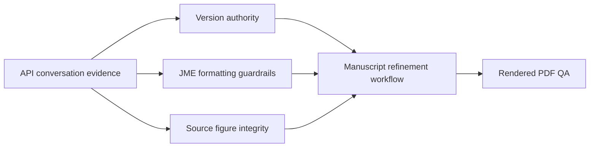

# XLW1 Manuscript Knowledge Map

This map links the verified, project-specific knowledge extracted from prior API-mode conversations without importing raw conversation content.

## Links

- Evidence: [[XLW1 API Conversation Evidence]]
- Decision: [[XLW1 Version Authority]]
- Constraint: [[XLW1 JME Formatting Guardrails]]
- Constraint: [[XLW1 Source Figure Integrity]]
- Workflow: [[XLW1 Manuscript Refinement Workflow]]
- Related: [[Project Knowledge Boundary]]
