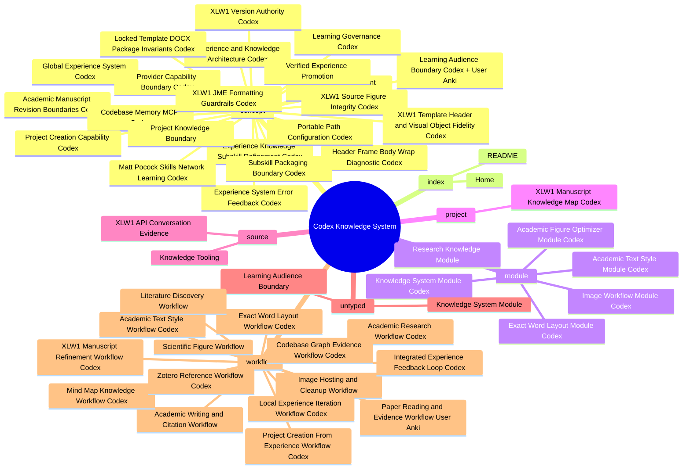

# Codex Knowledge Map

Generated from canonical Markdown notes. Do not edit this file directly.

```mermaid
mindmap
  root((Codex Knowledge System))
    concept
      Academic Manuscript Revision Boundaries Codex
      Codebase Memory MCP Codex
      Experience Knowledge Subskill Refinement Codex
      Experience System Error Feedback Codex
      Experience and Knowledge Architecture Codex
      Global Experience System Codex
      Header Frame Body Wrap Diagnostic Codex
      Learning Audience Boundary Codex + User Anki
      Learning Governance Codex
      Locked Template DOCX Package Invariants Codex
      Matt Pocock Skills Network Learning Codex
      Mother Skill Refinement Codex
      Portable Path Configuration Codex
      Project Creation Capability Codex
      Project Knowledge Boundary
      Provider Capability Boundary Codex
      Subskill Packaging Boundary Codex
      Verified Experience Promotion
      XLW1 JME Formatting Guardrails Codex
      XLW1 Source Figure Integrity Codex
      XLW1 Template Header and Visual Object Fidelity Codex
      XLW1 Version Authority Codex
    index
      Home
      README
    module
      Academic Figure Optimizer Module Codex
      Academic Text Style Module Codex
      Exact Word Layout Module Codex
      Image Workflow Module Codex
      Knowledge System Module Codex
      Research Knowledge Module
    project
      XLW1 Manuscript Knowledge Map Codex
    source
      Knowledge Tooling
      XLW1 API Conversation Evidence
    untyped
      Knowledge System Module
      Learning Audience Boundary
    workflow
      Academic Research Workflow Codex
      Academic Text Style Workflow Codex
      Academic Writing and Citation Workflow
      Codebase Graph Evidence Workflow Codex
      Exact Word Layout Workflow Codex
      Image Hosting and Cleanup Workflow
      Integrated Experience Feedback Loop Codex
      Literature Discovery Workflow
      Local Experience Iteration Workflow Codex
      Mind Map Knowledge Workflow Codex
      Paper Reading and Evidence Workflow User Anki
      Project Creation From Experience Workflow Codex
      Scientific Figure Workflow
      XLW1 Manuscript Refinement Workflow Codex
      Zotero Reference Workflow Codex
```
