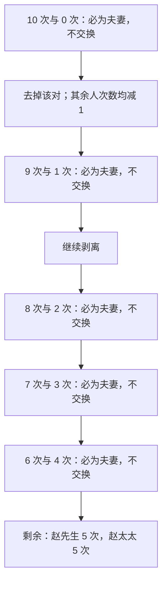

# 礼物交换题：逐层剥离图示

此示例只展示已证明的夫妻配对与次数剥离，不展示每一条礼物交换边。

```mermaid
flowchart TD
    A["10 次与 0 次：必为夫妻，不交换"] --> A1["去掉该对；其余人次数均减 1"]
    A1 --> B["9 次与 1 次：必为夫妻，不交换"]
    B --> B1["继续剥离"]
    B1 --> C["8 次与 2 次：必为夫妻，不交换"]
    C --> D["7 次与 3 次：必为夫妻，不交换"]
    D --> E["6 次与 4 次：必为夫妻，不交换"]
    E --> F["剩余：赵先生 5 次，赵太太 5 次"]
```

结论：赵先生与赵太太各交换 5 次。图中的每一层都来自同一规则：
当前最高次数者已经与所有允许对象交换，而当前 0 次者无法与任何人交换，
二者只能是彼此的配偶。
